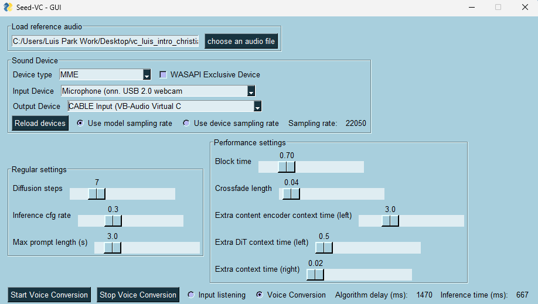
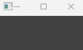

# DoppleDanger

DoppleDanger utilizes live face swapping and live voice cloning as a hyper-realistic impersonation technique. We used the [ReSwapper repository](https://github.com/somanchiu/ReSwapper) for the face swapping, and the [seed-vc repository](https://github.com/Plachtaa/seed-vc) for the voice cloning. 

In a way, this is an extension/improvement of the [Deep-Live-Cam repository](https://github.com/hacksider/Deep-Live-Cam). The [ReSwapper repository](https://github.com/somanchiu/ReSwapper) is an attempt to replicate the face swapping model found in the  [Deep-Live-Cam repository](https://github.com/hacksider/Deep-Live-Cam). The reason why we simply don't just use the model from the [Deep-Live-Cam repository](https://github.com/hacksider/Deep-Live-Cam) is because this model seems to have some GPU bottleneck that significantly increases inference time. This bottleneck results in the live swapping functionality to average at about 8-10 fps(RTX-3090) with only about 10-15 percent of the GPU being utilized. 

Using the ReSwapper model, the live swapping functionality now averages at around 17-20 fps.

## Demo
https://github.com/user-attachments/assets/b8037473-0f2f-41c9-acbf-4ca0cbe7e5b9


## Installation
### Platform
- [ffmpeg](https://www.youtube.com/watch?v=OlNWCpFdVMA)
- python==3.10
### Clone and Dependencies

```bash
git clone git@github.com:luispark6/DoppleDanger.git
cd ReSwapper

python -m venv venv
venv\scripts\activate
or
conda create -n reswap python=3.10
conda activate reswap

pip install -r requirements.txt --no-deps

pip install torch torchvision torchaudio --force --index-url https://download.pytorch.org/whl/cu121
pip install onnxruntime-gpu --force --extra-index-url https://aiinfra.pkgs.visualstudio.com/PublicPackages/_packaging/onnxruntime-cuda-12/pypi/simple/
pip install numpy==1.26.4
```
### Models

- You must then install the GFPGAN model and place it in the models directory. Download Link: https://github.com/TencentARC/GFPGAN/releases/download/v1.3.0/GFPGANv1.3.pth

- Finally, download one of the inswapper models found below in the **Pretrained Model** section and place it in the models directory as well.

- Note that these both should be .pth files

### Optional Downloads
- If you want to stream the live face swap to a virtual camera, you must download [obs](https://obsproject.com/). 
- If you want to stream the live voice cloning to a virtual audio cable, you must download [VB-Audio](https://vb-audio.com/Cable/)(Windows) or Pulse Audio(Linux)
- If these are desired functionalities, please read the **Virtual Camera/Audio** section for more information 


### After installation, you’ll need to modify the degradations.py file in your basicsr module only if you want to have converting video capabilties. This is NOT needed for the live face swap and voice cloning
If using conda, you can typically find this file at:
```
<your_env_path>/Lib/site-packages/basicsr/data/degradations.py
```
If using python venv, you can typically find this file at:
```
.\DoppleDanger\venv\Lib\site-packages\basicsr\data\degradations.py
```
The 8th line should look like the following:
```
from torchvision.transforms.functional_tensor import rgb_to_grayscale
```
Simply change this line to the following:
```
from torchvision.transforms.functional import rgb_to_grayscale
```

## Live Face Swap 
```
python .\swap_live_video.py --source .png --modelPath /path/to/model 
```
| Argument                     | Type    | Required | Default | Description                                                                                                                |
| ---------------------------- | ------- | -------- | ------- | -------------------------------------------------------------------------------------------------------------------------- |
| `--source`                   | `str`   | ✅ Yes    | —       | Path to the **source face image** (used for swapping onto webcam feed).                                                    |
| `--modelPath`                | `str`   | ✅ Yes    | —       | Path to the **trained face swap model** file (e.g., `.pth` or `.onnx`).                                                    |
| `--resolution`               | `int`   | ❌ No     | `128`   | Resolution (in pixels) to which detected faces will be cropped and resized before processing.                              |
| `--face_attribute_direction` | `str`   | ❌ No     | `None`  | Path to a `.npy` file containing a **face attribute direction vector**, used to modify facial features (e.g., beard). |
| `--face_attribute_steps`     | `float` | ❌ No     | `0.0`   | Amount to **move along the attribute direction**. Higher values apply stronger feature changes.                            |
| `--obs`                      | `flag`  | ❌ No     | `False` | If set, **sends frames to OBS virtual camera** (requires OBS virtual cam installed and active).                            |
| `--mouth_mask`               | `flag`  | ❌ No     | `False` | If set, **retains the target (webcam) mouth** instead of replacing it with the source mouth.                               |
| `--delay`                    | `int`   | ❌ No     | `0`     | Time delay in milliseconds to apply to the livestream. Useful for synchronizing the face swap video with voice cloning or other audio sources during a live stream|
| `--fps_delay`                | `flag`  | ❌ No     | `False` | If set, **displays FPS and delay time** on the top corner of the output video.                                             |

- During the livestream, you can increase or decrease delay time(50ms) by pressing plus(+) or minus(-) 

## Live Voice Cloning
```
cd seed_vc
python real-time-gui.py
```

GUI after running 'python real-time-gui.py


- **Notes about important setting values**:
  
- Toggle the settings above best for your GPU(I suggest a higher Inference cfg rate than 0.3, as Ingerence cfg rate determines how similar you want your voice to sound to the reference voice)
- The only crucially important settings are the Diffusion Steps and Block Time. Make sure Diffusion Steps are between 5-15. If it is too high, inference time will be longer which will cause quite a delay. Furthermore, make sure the **Block Time** is HIGHER than the inference time as you can see in the bottom right. If at any point the inference time is lower than the Block Time, the voice cloning will start stuttering than crash!!(Note Block Time is in seconds, so simply multiply by 1000, then compare to inference time)
- Press Start Voice Conversion after inputting proper fields


## Quick Use of Converting Video(Optional for high quality face cloning using recorded video)
```
python .\swap_video.py --source ..\.png --target_video .\<video>.mp4 --modelPath .\models\<reswapper_model>.pth 
```


## Coordinating Live Face Swap and Voice Cloning
1. First open two terminals, both running on the same virtual environment
2. Run ```python .\swap_live_video.py --source .png --modelPath /path/to/model``` on terminal 1
3. Then run ```cd seed_vc``` and ```python real-time-gui.py```
4. Pick the refrence audio, input/output device, and setting values, then press ```Start Voice Conversion```
5. Now press on the live face-swap recording window (the window that popped up after running step 2) and press + or - to decrease or increase the delay time(50ms). Do this until the voice cloning synchronizes with the face swap

NOTE: We have to synchronize because the voice cloning inference time is slower than the face swap inference time. So if we delay the face swap, they will then be synchronized. 

## Virtual Camera/Audio
You can also stream the live face swap and the voice cloning to a video meeting such as Zoom, Google Meets, Microsoft Teams Meeting, etc.. 

### Virtual Camera
To send the live face swaps to a video meeting, please follow the steps below:
1. Download  [obs](https://obsproject.com/) (compatible for Windows, Mac, Linux)
2. Run ```python .\swap_live_video.py --source .png --modelPath /path/to/model --obs``` (obs flag MUST be set)
3. Go to the preferred video meeting platform (we will use google meets as an example)
4. 

Go to the camera settings, and pick ```OBS Virtual Camera```

5. Your all set! The live face swap should be shown in the virtual meeting

### Virtual Audio
To send the live voice cloning to a video meeting, please follow the steps below:
#### Windows:
1. Download [VB-Audio](https://vb-audio.com/Cable/)
2. run ```cd seed_vc```
3. run ```python real-time-gui.py```
4. 

**Set the Output Device** to **Cable Input (VB-Audio Virtual C)**

5. Go to the preferred video meeting platform (we will use google meets as an example)

6. 

**Set the Audio Input** to **Cable Output (VB-Audio Virtual Cable)**

7. You should be all set!

#### Linux
1. run ```sudo apt install pulseaudio pavucontrol```
2. run ```pavucontrol```
3. run ```pactl load-module module-null-sink sink_name=VirtualSink sink_properties=device.description=Virtual_Audio_Cable```   
This creates Virtual Output:  
Output:Virtual_Audio_Cable
Input: Monitor of Virtual_Audio_Cable
4. run ```python real-time-gui.py```
5. In the gui, pick **Virtual_Audio_Cable** as the output
6. In the virtual meeting platform, go under Microphone and choose **Monitor of Virtual_Audio_Cable** as the input
7. You show be alls set!

I have not yet tried this method so please send an issue if it does not work.

#### Delay Time for Live Face Swap for Virtual Camera
- To delay the Live Face Swap for synchronization with the voice cloning, run ```python .\swap_live_video.py --source .png --modelPath /path/to/model --obs```, and an empty pop-up window will appear(it is empty because frames are being sent to the virtual camera). 



- Then, click the empty window, and press either + or - to toggle the delay time by 50ms


## Training
<details open>

<summary>GAN Approach</summary>

See the [GAN branch](https://github.com/somanchiu/ReSwapper/tree/GAN)
</details>

<details open>

<summary>Supervised Learning Approach</summary>

### 0. Pretrained weights (Optional)
If you don't want to train the model from scratch, you can download the pretrained weights and pass model_path into the train function in train.py.

### 1. Dataset Preparation
Download [FFHQ](https://www.kaggle.com/datasets/arnaud58/flickrfaceshq-dataset-ffhq) to use as target and source images. For the swaped face images, we can use the inswapper output.

### 2. Model Training

Optimizer: Adam

Learning rate: 0.0001

Modify the code in train.py if needed. Then, execute:
```python
python train.py
```

The model will be saved as "reswapper-\<total steps\>.pth". You can also save the model as ONNX using the ModelFormat.save_as_onnx_model function. The ONNX model can then be used with the original INSwapper class.

All losses will be logged into TensorBoard.

Using images with different resolutions simultaneously to train the model will enhance its generalization ability. To apply this strategy, you can pass "resolutions" into the train function.

Generalization ability of the model trained with resolutions of 128 and 256:

| Output<br>resolution | 128 | 160 | 256 |
|--------|--------|--------|--------|
|Output|  | | |

Enhancing data diversity will improve output quality, you can pass "enableDataAugmentation" into the train function to perform data augmentation.

| Target | Source | Inswapper Output | Reswapper Output<br>(Step 1567500) | Reswapper Output<br>(Step 1399500) |
|--------|--------|--------|--------|--------|
||  | | |  |

#### Notes
- Do not stop the training too early.

- I'm using an RTX3060 12GB for training. It takes around 12 hours for 50,000 steps.
- The optimizer may need to be changed to SGD for the final training, as many articles show that SGD can result in lower loss.
- To get inspiration for improving the model, you might want to review the commented code and unused functions in commit [c2a12e10021ecd1342b9ba50570a16b18f9634b9](https://github.com/somanchiu/ReSwapper/commit/c2a12e10021ecd1342b9ba50570a16b18f9634b9).

</details>


## Face Attribute Modification
The source embedding contains information about various facial attributes. Modifying the source enables adjustments to specific attributes.

### 1. Paired Datasets Collection
For example, modifying facial hair (Beard vs. No Beard):
```python
dataset_a = FaceAttribute.create_linear_direction_dataset("Beard or No Beared\\Train\\Beard", "beard.npy")
dataset_b = FaceAttribute.create_linear_direction_dataset("Beard or No Beared\\Train\\No Beard", "no_beard.npy")
```
### 2. Attribute Direction Calculation
```python
direction = FaceAttribute.get_direction(dataset_a, dataset_b, "direction.npy")
```

### 3. Source Embedding Modification
```python
direction = direction / np.linalg.norm(direction)
latent += direction * face_attribute_steps
```

Here is the output of Inswapper after modifying the source embedding

| face_attribute_steps | 0 (Original output) | 0.25 | 0.5  | 0.75 | 1.0 |
|--------|--------|--------|--------|--------|--------|
|beard_direction.npy||||||

## Pretrained Model
### 256 Resolution
- [reswapper_256-1567500.pth](https://huggingface.co/somanchiu/reswapper/tree/main)
- [reswapper_256-1399500.pth](https://huggingface.co/somanchiu/reswapper/tree/main)

### 128 Resolution
- [reswapper-1019500.pth](https://huggingface.co/somanchiu/reswapper/tree/main)
- [reswapper-1019500.onnx](https://huggingface.co/somanchiu/reswapper/tree/main)
- [reswapper-429500.pth](https://huggingface.co/somanchiu/reswapper/tree/main)
- [reswapper-429500.onnx](https://huggingface.co/somanchiu/reswapper/tree/main)

### Notes
If you downloaded the ONNX format model before 2024/11/25, please download the model again or export the model with opset_version=11. This is related to issue #8.

## Attribute Direction
- [beard_direction.npy
](https://huggingface.co/somanchiu/reswapper/tree/main/attributeDirection)

## To Do
- Create a 512-resolution model (alternative to inswapper_512)
