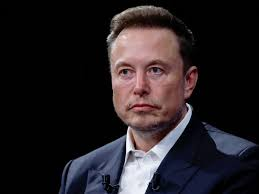
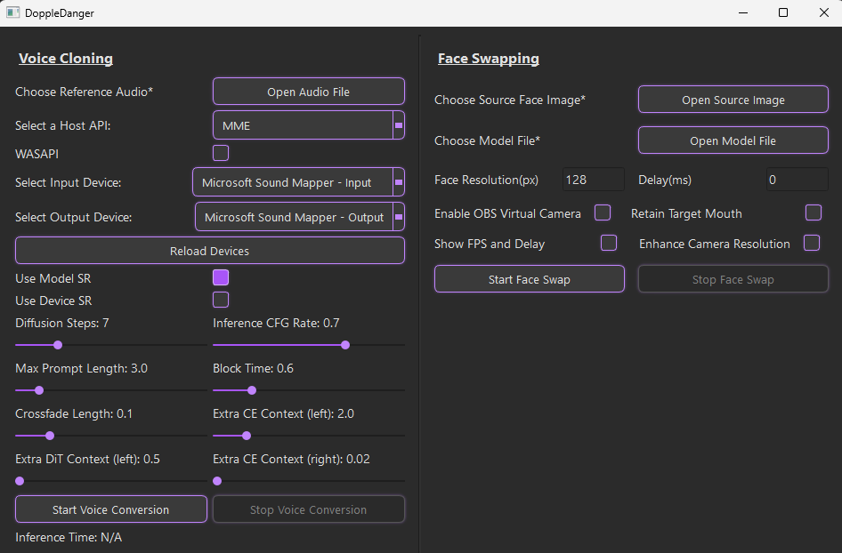
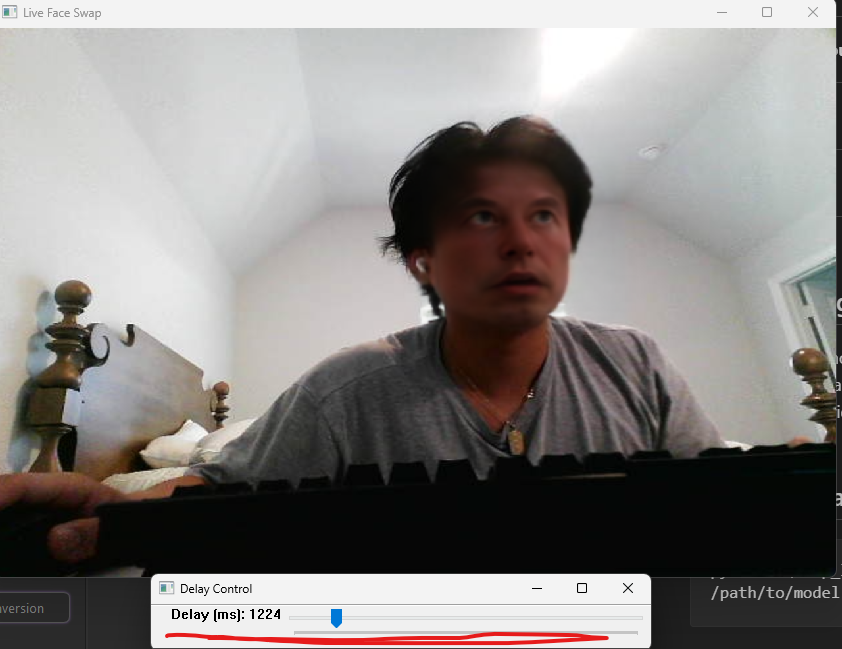
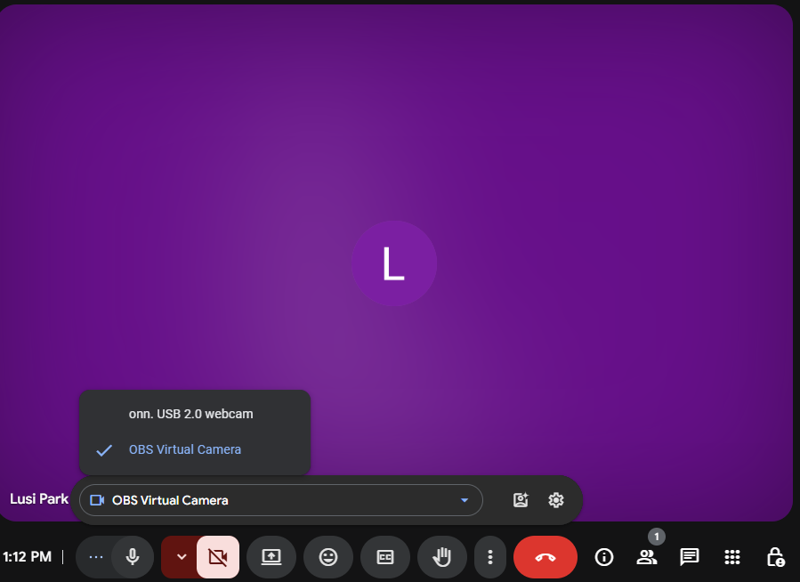
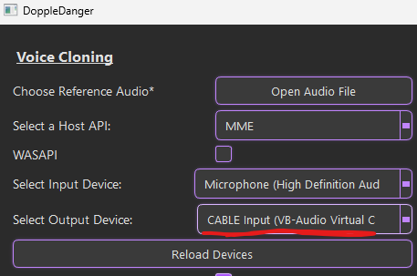
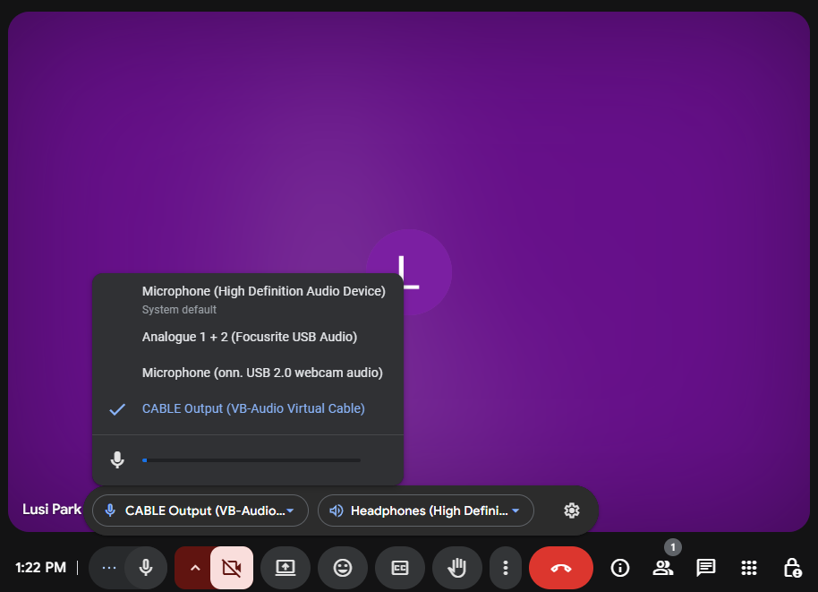

# DoppleDanger

DoppleDanger utilizes live face swapping and live voice cloning as a hyper-realistic impersonation technique. We used the [ReSwapper repository](https://github.com/somanchiu/ReSwapper) for the face swapping, and the [seed-vc repository](https://github.com/Plachtaa/seed-vc) for the voice cloning. 

In a way, this is an extension/improvement of the [Deep-Live-Cam repository](https://github.com/hacksider/Deep-Live-Cam). The [ReSwapper repository](https://github.com/somanchiu/ReSwapper) is an attempt to replicate the face swapping model found in the  [Deep-Live-Cam repository](https://github.com/hacksider/Deep-Live-Cam). The reason why we simply don't just use the model from the [Deep-Live-Cam repository](https://github.com/hacksider/Deep-Live-Cam) is because this model seems to have some GPU bottleneck that significantly increases inference time. This bottleneck results in the live swapping functionality to average at about 8-10 fps(RTX-3090) with only about 10-15 percent of the GPU being utilized. 

Using the ReSwapper model, the live swapping functionality now averages at around 20 fps on a RTX3090. If enhance resolution option is set to True, the live swapping averages at around 15-16 fps. 


## 🎬 Demo 

**🔗 Video Demo(High Resolution):**  

https://github.com/user-attachments/assets/68203de5-6e89-4fe4-aba1-4067d199c78c


**🔗 Video Demo(Low Resolution):**  


https://github.com/user-attachments/assets/de93187e-3b75-44b4-b270-ef8ae0571062


---

### 🖼️ Reference Photo  


---

### 🔊 Reference Audio
https://github.com/user-attachments/assets/122ad8ba-7968-4ca7-a0b5-dde8b0f47f32  

Note that reference audio should be a WAV file. Only using MP4 to show on README file.


## Installation
### Platform Requirements
- Windows 
- [ffmpeg](https://www.youtube.com/watch?v=OlNWCpFdVMA)
- python==3.10
- CUDA 12.x and cuDNN 9.x


### Executable File
https://drive.google.com/file/d/1AISt-wCPGW8ofHkx8O3S-4ueL5GG5uV4/view?usp=sharing

- Download and unzip the file
- Download one of the inswapper models found below in the Pretrained Model section which can be found a the bottom of this repository
- Run unified_gui.exe which can be found in the unzipped file
 
 ### Tutorial for DoppleDanger (for those who cloned and forked, NOT for exe)
 Youtube Link: https://www.youtube.com/watch?v=VzEpxL9LKuo

### Clone and Dependencies

```bash
git clone git@github.com:luispark6/DoppleDanger.git
cd DoppleDanger

python -m venv venv
venv\scripts\activate
or
conda create -n doppledanger python=3.10
conda activate doppledanger


pip install -r requirements.txt --no-deps

pip install torch==2.5.1+cu121 torchvision===0.20.1+cu121 torchaudio==2.5.1+cu121 --force --index-url https://download.pytorch.org/whl/cu121

pip install onnxruntime-gpu==1.20.0 --force --extra-index-url https://aiinfra.pkgs.visualstudio.com/PublicPackages/_packaging/onnxruntime-cuda-12/pypi/simple/

pip install numpy==1.26.4

pip uninstall typing

**Ignore Dependency Warnings
```


### Models
- You must then install the GFPGAN model and place it in the ```DoppleDanger/models``` directory. Download Link: https://github.com/TencentARC/GFPGAN/releases/download/v1.3.0/GFPGANv1.3.pth

- Finally, download one of the inswapper models found below in the **Pretrained Model** section and place it in the ```DoppleDanger/models``` directory as well.

- Note that these both should be .pth files

### Optional Downloads
- If you want to stream the live face swap to a virtual camera, you must download [obs](https://obsproject.com/). 
- If you want to stream the live voice cloning to a virtual audio cable, you must download [VB-Audio](https://vb-audio.com/Cable/)(Windows) or Pulse Audio(Linux)
- If these are desired functionalities, please read the **Virtual Camera/Audio** section for more information 


## Live Face Swap and Voice Cloning GUI

```
python unified_gui.py
```


### Quick Start
#### Voice Cloning 
1. Choose Reference Audio: the voice of which you would like to clone
2. Properly Select the Input and Output Devices
3. Press "Start Voice Conversion"

#### Face Swapping
1. Choose Souce Face Image: the face of which you would like to clone
2. Choose Model File: the ReSwapper model placed in the models directory
3. Press "Face Swap" 

***Note that you are able to run both Voice Cloning and Face Swapping simultaneously***


### 🎤 Voice Cloning Settings
| Setting                      | Description                                                                                                      |
| ---------------------------- | ---------------------------------------------------------------------------------------------------------------- |
| **Choose Reference Audio**\* | Opens a file dialog to select the reference audio clip that will be used for cloning the voice.                  |
| **Select a Host API**        | Lets you choose the audio backend, e.g., MME, WASAPI, etc., depending on your system's configuration.            |
| **WASAPI**                   | If checked, enables the WASAPI host API explicitly.                                                              |
| **Select Input Device**      | Choose the microphone or input audio device to use for capturing voice.                                          |
| **Select Output Device**     | Choose the output device (e.g., speakers, virtual cable) where the audio will be played.                         |
| **Reload Devices**           | Refreshes the list of input/output devices in case new ones were added.                                          |
| **Use Model SR**             | Enables the use of a pre-trained model for Super Resolution (SR) audio enhancement.                              |
| **Use Device SR**            | Uses SR capabilities of the audio device (if available) instead of a model.                                      |
| **Diffusion Steps**          | Sets how many steps are used during voice generation. More steps generally yield higher quality but take longer. |
| **Inference CFG Rate**       | Controls how strongly the model follows the conditioning reference. Higher values = closer mimicry.              |
| **Max Prompt Length**        | Sets the maximum length (in seconds) of the reference audio used for conditioning.                               |
| **Block Time**               | Sets how long each block of audio is processed. Lower values reduce latency.                                     |
| **Crossfade Length**         | Duration (in seconds) of audio overlap for smoothing between blocks.                                             |
| **Extra DiT Context (left)** | Extra context in seconds given to the left of the current audio block for the DiT model.                         |
| **Extra CE Context (left)**  | Additional left-side context passed to the CE model for improved synthesis.                                      |
| **Extra CE Context (right)** | Additional right-side context passed to the CE model. Helps in smoother transitions.                             |
| **Start Voice Conversion**   | Begins real-time voice conversion using the selected settings.                                                   |
| **Stop Voice Conversion**    | Stops the voice conversion process.                                                                              |
| **Inference Time**           | Shows how long each inference takes (useful for performance tuning).                                             |


### 🧑‍🦲 Face Swapping Settings
| Setting                        | Description                                                                                             |
| ------------------------------ | ------------------------------------------------------------------------------------------------------- |
| **Choose Source Face Image**\* | Upload an image of the face you want to use as the source (e.g., a celebrity or character).             |
| **Choose Model File**\*        | Reswapper Model in the ./models folder                                                         |
| **Face Resolution (px)**       | Sets the resolution of the face image used for swapping. Common values: 128, 256, etc.                  |
| **Delay (ms)**                 | Adds a delay to the processing stream. Can help sync face swap with audio/video.                        |
| **Enable OBS Virtual Camera**  | Enables output through OBS’s virtual camera for real-time streaming.                                    |
| **Show FPS and Delay**         | Displays real-time performance metrics like frames per second and processing delay.                     |
| **Retain Target Mouth**        | Keeps the mouth of the target face instead of replacing it from the source image. |
| **Enhance Camera Resolution**  | Increases resolution of the output camera feed for sharper results.                                     |
| **Start Face Swap**            | Begins real-time face swapping using the selected image and model.                                      |
| **Stop Face Swap**             | Ends the face swapping process.                                                                         |


## Synchronizing Live Voice Clone and Face Swap
The voice cloning model has a slightly longer inference time compared to the face swapping model, resulting in a noticeable timing mismatch between the generated audio and the lip movements in the video. To get these models in sync, you have to delay the face swapping by a bit. When you press ```Start Face Swap```, a live cam of the face swap and a slider should pop up. The slider will delay the live cam by some millisecond amount. Please adjust accordingly until the face swap and voice cloning is in sync. 



## Live Face Swap Command Line
```
python .\swap_live_video.py --source .png --modelPath /path/to/model 
```
| Argument                     | Type    | Required | Default | Description                                                                                                                |
| ---------------------------- | ------- | -------- | ------- | -------------------------------------------------------------------------------------------------------------------------- |
| `--source`                   | `str`   | ✅ Yes    | —       | Path to the **source face image** (used for swapping onto webcam feed).                                                    |
| `--modelPath`                | `str`   | ✅ Yes    | —       | Path to the **trained face swap model** file (should be the ReSwapper .pth file, NOT the GFPGAN model).                                                    |
| `--resolution`               | `int`   | ❌ No     | `128`   | Resolution (in pixels) to which detected faces will be cropped and resized before processing.                              |
| `--enhance_res`              | `flag`  | ❌ No (however recommended to set to `True`)| `False`| Increase webcam resolution to 1920x1080|
| `--face_attribute_direction` | `str`   | ❌ No     | `None`  | Path to a `.npy` file containing a **face attribute direction vector**, used to modify facial features (e.g., beard). |
| `--face_attribute_steps`     | `float` | ❌ No     | `0.0`   | Amount to **move along the attribute direction**. Higher values apply stronger feature changes.                            |
| `--obs`                      | `flag`  | ❌ No     | `False` | If set, **sends frames to OBS virtual camera** (requires OBS virtual cam installed and active).                            |
| `--mouth_mask`               | `flag`  | ❌ No     | `False` | If set, **retains the target (webcam) mouth** instead of replacing it with the source mouth.                               |
| `--delay`                    | `int`   | ❌ No     | `0`     | Time delay in milliseconds to apply to the livestream. Useful for synchronizing the face swap video with voice cloning or other audio sources during a live stream|
| `--fps_delay`                | `flag`  | ❌ No     | `False` | If set, **displays FPS and delay time** on the top corner of the output video.                                             |


## Virtual Camera/Audio
You can also stream the live face swap and the voice cloning to a video meeting such as Zoom, Google Meets, Microsoft Teams Meeting, etc.. 

### Virtual Camera
To send the live face swaps to a video meeting, please follow the steps below:
1. Download  [obs](https://obsproject.com/) (compatible for Windows, Mac, Linux)
2. Run ```python .\swap_live_video.py --source .png --modelPath /path/to/model --obs``` (obs flag MUST be set) or ```python unified_gui.py```(pick OBS flag and press Start Face Swap)
3. Go to the preferred video meeting platform (we will use google meets as an example)
4. 

Go to the camera settings, and pick ```OBS Virtual Camera```

5. Your all set! The live face swap should be shown in the virtual meeting

### Virtual Audio
To send the live voice cloning to a video meeting, please follow the steps below:
1. Download [VB-Audio](https://vb-audio.com/Cable/)
2. run ```python unified_gui.py```
3. 
  
**Set the Output Device** to **Cable Input (VB-Audio Virtual C)**

4. Go to the preferred video meeting platform (we will use google meets as an example)

5. 

**Set the Audio Input** to **Cable Output (VB-Audio Virtual Cable)**

6. You should be all set!


## Training
<details open>

<summary>GAN Approach</summary>

See the [GAN branch](https://github.com/somanchiu/ReSwapper/tree/GAN)
</details>

<details open>

<summary>Supervised Learning Approach</summary>

### 0. Pretrained weights (Optional)
If you don't want to train the model from scratch, you can download the pretrained weights and pass model_path into the train function in train.py.

### 1. Dataset Preparation
Download [FFHQ](https://www.kaggle.com/datasets/arnaud58/flickrfaceshq-dataset-ffhq) to use as target and source images. For the swaped face images, we can use the inswapper output.

### 2. Model Training

Optimizer: Adam

Learning rate: 0.0001

Modify the code in train.py if needed. Then, execute:
```python
python train.py
```

The model will be saved as "reswapper-\<total steps\>.pth". You can also save the model as ONNX using the ModelFormat.save_as_onnx_model function. The ONNX model can then be used with the original INSwapper class.

All losses will be logged into TensorBoard.

Using images with different resolutions simultaneously to train the model will enhance its generalization ability. To apply this strategy, you can pass "resolutions" into the train function.

Generalization ability of the model trained with resolutions of 128 and 256:

| Output<br>resolution | 128 | 160 | 256 |
|--------|--------|--------|--------|
|Output|  | | |

Enhancing data diversity will improve output quality, you can pass "enableDataAugmentation" into the train function to perform data augmentation.

| Target | Source | Inswapper Output | Reswapper Output<br>(Step 1567500) | Reswapper Output<br>(Step 1399500) |
|--------|--------|--------|--------|--------|
||  | | |  |

#### Notes
- Do not stop the training too early.

- I'm using an RTX3060 12GB for training. It takes around 12 hours for 50,000 steps.
- The optimizer may need to be changed to SGD for the final training, as many articles show that SGD can result in lower loss.
- To get inspiration for improving the model, you might want to review the commented code and unused functions in commit [c2a12e10021ecd1342b9ba50570a16b18f9634b9](https://github.com/somanchiu/ReSwapper/commit/c2a12e10021ecd1342b9ba50570a16b18f9634b9).

</details>


## Face Attribute Modification
The source embedding contains information about various facial attributes. Modifying the source enables adjustments to specific attributes.

### 1. Paired Datasets Collection
For example, modifying facial hair (Beard vs. No Beard):
```python
dataset_a = FaceAttribute.create_linear_direction_dataset("Beard or No Beared\\Train\\Beard", "beard.npy")
dataset_b = FaceAttribute.create_linear_direction_dataset("Beard or No Beared\\Train\\No Beard", "no_beard.npy")
```
### 2. Attribute Direction Calculation
```python
direction = FaceAttribute.get_direction(dataset_a, dataset_b, "direction.npy")
```

### 3. Source Embedding Modification
```python
direction = direction / np.linalg.norm(direction)
latent += direction * face_attribute_steps
```

Here is the output of Inswapper after modifying the source embedding

| face_attribute_steps | 0 (Original output) | 0.25 | 0.5  | 0.75 | 1.0 |
|--------|--------|--------|--------|--------|--------|
|beard_direction.npy||||||

## Pretrained Model
### 256 Resolution
- [reswapper_256-1567500.pth](https://huggingface.co/somanchiu/reswapper/tree/main)
- [reswapper_256-1399500.pth](https://huggingface.co/somanchiu/reswapper/tree/main)

### 128 Resolution
- [reswapper-1019500.pth](https://huggingface.co/somanchiu/reswapper/tree/main)
- [reswapper-1019500.onnx](https://huggingface.co/somanchiu/reswapper/tree/main)
- [reswapper-429500.pth](https://huggingface.co/somanchiu/reswapper/tree/main)
- [reswapper-429500.onnx](https://huggingface.co/somanchiu/reswapper/tree/main)

### Notes
If you downloaded the ONNX format model before 2024/11/25, please download the model again or export the model with opset_version=11. This is related to issue #8.

## Attribute Direction
- [beard_direction.npy
](https://huggingface.co/somanchiu/reswapper/tree/main/attributeDirection)


### After installation, you’ll need to modify the degradations.py file in your basicsr module only if you want to have converting video capabilties. This is NOT needed for the live face swap and voice cloning
If using conda, you can typically find this file at:
```
<your_env_path>/Lib/site-packages/basicsr/data/degradations.py
```
If using python venv, you can typically find this file at:
```
.\DoppleDanger\venv\Lib\site-packages\basicsr\data\degradations.py
```
The 8th line should look like the following:
```
from torchvision.transforms.functional_tensor import rgb_to_grayscale
```
Simply change this line to the following:
```
from torchvision.transforms.functional import rgb_to_grayscale
```


## Quick Use of Converting Video(Optional for high quality face cloning using recorded video)
```
python .\swap_video.py --source ..\.png --target_video .\<video>.mp4 --modelPath .\models\<reswapper_model>.pth 
```

## To Do
- Create a 512-resolution model (alternative to inswapper_512)
